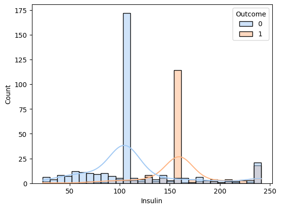
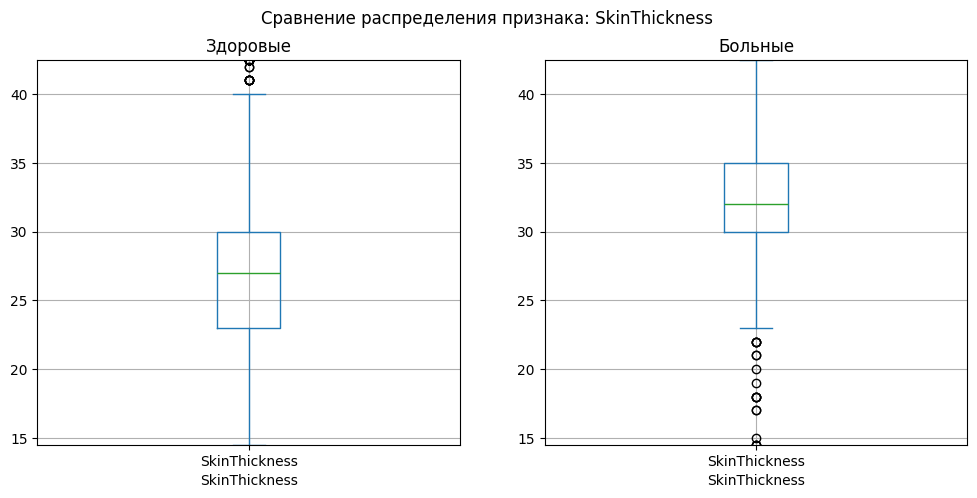
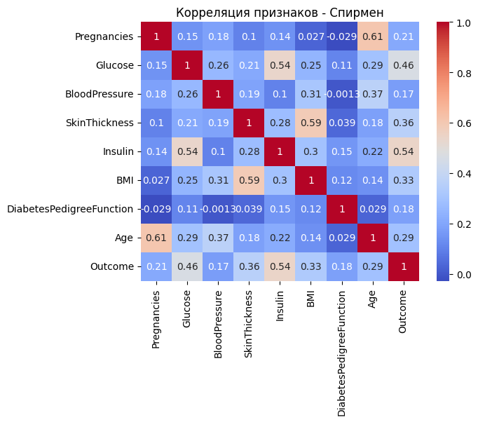

# Diabetes Prediction using Machine Learning

## Описание проекта

Данный проект посвящён исследованию методов машинного обучения для прогнозирования сахарного диабета 2 типа на основе медицинских показателей пациентов.

В работе был проведён:
- разведочный анализ данных (EDA);
- статистический анализ признаков;
- проверка гипотез;
- обучение и сравнение моделей бинарной классификации;
- настройка гиперпараметров моделей;
- оценка качества моделей с использованием различных метрик.

Цель проекта — определить наиболее эффективную модель классификации для задачи диагностики диабета.

---

# Используемый датасет

В проекте используется датасет Pima Indians Diabetes Database.

## Признаки:
- Pregnancies
- Glucose
- BloodPressure
- SkinThickness
- Insulin
- BMI
- DiabetesPedigreeFunction
- Age

## Целевая переменная:
- Outcome:
  - 0 — отсутствие диабета
  - 1 — наличие диабета

---

# Используемые библиотеки

Проект реализован на Python с использованием следующих библиотек:

```python
pandas
numpy
matplotlib
seaborn
scikit-learn
scipy
```

---

# Этапы работы

## 1. Предобработка данных

Выполнены:
- разделение данных на train / validation / test;
- проверка распределений признаков;
- стандартизация признаков;
- предотвращение утечки данных (Data Leakage).

---

## 2. Разведочный анализ данных (EDA)

Проведён анализ:
- распределений признаков;
- выбросов;
- различий между группами;
- корреляций признаков.

Использовались:
- histogram;
- boxplot;
- heatmap корреляционной матрицы.

---

## 3. Статистический анализ

Для проверки статистических гипотез использовались:
- тест Шапиро–Уилка;
- тест Левена;
- t-критерий Стьюдента;
- критерий Манна–Уитни;
- корреляция Пирсона;
- корреляция Спирмена.

---

# Используемые модели

В проекте исследованы следующие алгоритмы:

1. Logistic Regression
2. Decision Tree
3. Random Forest
4. Support Vector Machine (SVM)
5. Gradient Boosting

---

# Настройка гиперпараметров

Для моделей выполнялся подбор гиперпараметров:
- max_depth
- n_estimators
- min_samples_split
- min_samples_leaf
- learning_rate
- kernel
- C
- gamma

Оптимизация проводилась по метрике F1-score на validation выборке.

---

# Метрики оценки

Использовались:
- Accuracy
- Precision
- Recall
- F1-score
- ROC-AUC
- Confusion Matrix

---

# Лучшие результаты

## Random Forest

| Метрика | Значение |
|---|---|
| Accuracy | 0.896 |
| Precision | 0.821 |
| Recall | 0.865 |
| F1-score | 0.842 |
| ROC-AUC | 0.950 |

---

# Структура проекта

```text
project/
│
├── data/
│   └── diabetes.csv
│
├── notebooks/
│   └── analysis.ipynb
│
├── models/
│   └── trained_models/
│
├── images/
│   └── plots/
│
├── README.md
│
└── requirements.txt
```

---

# Пример запуска

## Установка зависимостей

```bash
pip install -r requirements.txt
```

## Запуск Jupyter Notebook

```bash
jupyter notebook
```

---

# Основные выводы исследования

В ходе исследования установлено:
- наиболее информативными признаками являются Glucose и Insulin;
- модели ансамблевого обучения показывают наилучшие результаты;
- Random Forest продемонстрировал лучший баланс между precision и recall;
- Gradient Boosting обеспечил наивысшее значение ROC-AUC;
- использование настройки гиперпараметров существенно улучшило качество классификации.

---

# Некоторые приложения

## Приложение А — Гистограмма распределения инсулина по больным и здоровым 



Рисунок 1 — Распределение признака Insulin

## Приложение Б — Ящики с усами распределений толщины кожной складки по больным и здоровым




Рисунок 2 — Распределение признака SkinThickness

## Приложение В —  heatmap корреляционной матрицы признаков по Спирмену




Рисунок 3 — Корреляционная матрица


Тема работы:
**«Применение методов машинного обучения для прогнозирования сахарного диабета 2 типа»**
