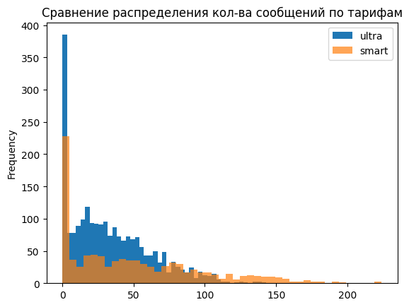
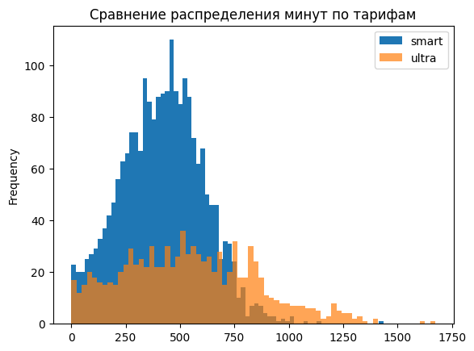

# Анализ тарифов телеком-компании «Мегалайн»

## Описание проекта

В данном проекте проведён аналитический разбор тарифных планов телеком-компании «Мегалайн» — **«Смарт»** и **«Ультра»**.  

Цель исследования — определить:
- как пользователи потребляют услуги связи,
- различается ли средняя выручка по тарифам,
- влияет ли регион пользователя на размер выручки.

Проект включает предобработку данных, исследовательский анализ, расчёт выручки и проверку статистических гипотез.

---

## Используемые данные

В анализе использовались следующие таблицы:

- `users` — информация о пользователях
- `calls` — данные о звонках
- `messages` — данные о сообщениях
- `internet` — данные об интернет-сессиях
- `tariffs` — описание тарифных планов

---

## Описание тарифов

### Тариф «Смарт»
- Абонентская плата: **550 руб./мес**
- Включено:
  - 500 минут
  - 50 сообщений
  - 15 ГБ интернета
- Сверх пакета:
  - 3 руб./минута
  - 3 руб./сообщение
  - 200 руб./ГБ

### Тариф «Ультра»
- Абонентская плата: **1950 руб./мес**
- Включено:
  - 3000 минут
  - 1000 сообщений
  - 30 ГБ интернета
- Сверх пакета:
  - 1 руб./минута
  - 1 руб./сообщение
  - 150 руб./ГБ

---

## Особенности тарификации

- Каждый звонок округляется до полной минуты.
- Интернет округляется по итоговой сумме за месяц до целых ГБ в большую сторону.
- Неиспользованные минуты, сообщения и интернет не переносятся на следующий месяц.

---

## Предобработка данных

В рамках подготовки данных были выполнены:

- Приведение дат к корректному формату
- Округление длительности звонков вверх
- Агрегация данных по пользователю и месяцу
- Перевод интернет-трафика из МБ в ГБ с округлением вверх
- Расчёт ежемесячной выручки для каждого пользователя

---

## Исследовательский анализ

Были проанализированы:

- Среднее потребление минут, сообщений и интернета
- Дисперсия и разброс значений
- Частота превышения лимитов
- Распределение выручки

### Основные наблюдения:

- Пользователи тарифа «Смарт» чаще превышают лимиты.
- Пользователи «Ультра» потребляют больше услуг, но редко выходят за пределы пакета.
- «Смарт» генерирует значительную долю выручки за счёт перерасхода.

---

## Анализ выручки

Средняя месячная выручка:

- **Смарт** ≈ 1290 руб.
- **Ультра** ≈ 2070 руб.

Вывод:
- «Ультра» приносит более высокую выручку на одного пользователя.
- «Смарт» обеспечивает дополнительную монетизацию за счёт превышений лимита.

---

## Проверка гипотез

### 1. Различается ли средняя выручка тарифов?

Использован t-тест с учётом различия дисперсий.

Результат:  
Средняя выручка по тарифам статистически различается.

### 2. Различается ли выручка между Москвой и регионами?

Статистически значимых различий не обнаружено.

---

## Итоговые выводы

- Тарифы ориентированы на разные модели поведения клиентов.
- «Смарт» подходит пользователям со средним уровнем активности, но часто приводит к дополнительным расходам.
- «Ультра» обеспечивает стабильную фиксированную выручку.
- Регион проживания не оказывает значимого влияния на доход компании.

---

## Используемые инструменты

- Python
- Pandas
- NumPy
- Matplotlib
- SciPy
- Jupyter Notebook

---

## Результат

Проект демонстрирует полный цикл аналитической работы:
- подготовка данных,
- исследовательский анализ,
- расчёт бизнес-метрик,
- статистическая проверка гипотез,
- формирование бизнес-выводов.

# Некоторые графики полученые во время анализа данных

